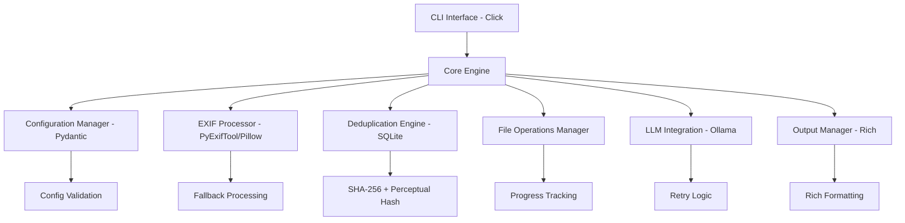
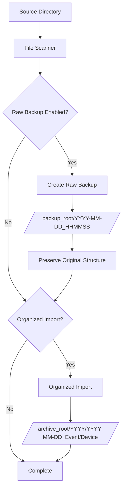

# Design Document

## Overview

The Photo Ingest Tool is a Python CLI application built with modern libraries for robust photo organization. The architecture follows a modular design with clear separation of concerns, enabling maintainability and extensibility. The tool uses Click for CLI management, Rich for beautiful output, Pydantic for configuration validation, and PyExifTool for reliable metadata extraction.

## Architecture

### High-Level Architecture



### Component Architecture

The application follows a layered architecture:

1. **CLI Layer**: Click-based command interface with subcommands
2. **Service Layer**: Core business logic and orchestration
3. **Data Layer**: File operations, database, and external tool integration
4. **Presentation Layer**: Rich-based output formatting and progress display

## Components and Interfaces

### 1. CLI Interface (`cli.py`)

**Primary Interface**: Click-based command structure
```python
@click.group()
@click.option('--verbose', '-v', count=True)
@click.option('--quiet', '-q', is_flag=True)
def main(verbose, quiet):
    """Photo Ingest Tool for organizing photography imports."""

@main.command()
@click.argument('folder', type=click.Path(exists=True))
@click.option('--config', type=click.Path())
@click.option('--json', is_flag=True)
@click.option('--peek', is_flag=True, help='Include visual content analysis')
@click.option('--exif-only', is_flag=True, help='Skip visual analysis even if LLM configured')
@click.option('--samples', default=5, help='Number of sample images per device for visual analysis')
def analyze(folder, config, json, peek, exif_only, samples):
    """Analyze folder contents with optional visual content analysis."""

@main.command()
@click.option('--config', type=click.Path())
@click.option('--source', required=True, type=click.Path(exists=True))
@click.option('--event', required=True)
@click.option('--dry-run', is_flag=True)
@click.option('--copy/--move', default=True)
@click.option('--raw-only', is_flag=True, help='Perform only raw backup')
@click.option('--organized-only', is_flag=True, help='Perform only organized import')
def ingest(config, source, event, dry_run, copy, raw_only, organized_only):
    """Ingest photos into structured archive with optional raw backup."""
```

### 2. Configuration Manager (`config.py`)

**Purpose**: Handle configuration loading, validation, and environment variable substitution

```python
class DeviceMapping(BaseModel):
    """Device detection and mapping configuration."""
    mappings: Dict[str, str]  # EXIF camera model -> folder name
    exif_identifiers: Dict[str, Dict[str, str]]  # device -> EXIF field mappings
    priority_rules: List[str] = []  # device priority for ambiguous cases
    
    # Example:
    # mappings:
    #   "NIKON Z 6": "Z6"
    #   "NIKON Z 6_2": "Z6II" 
    #   "DJI AIR 2S": "Drone"
    # exif_identifiers:
    #   "Z6":
    #     "Make": "NIKON CORPORATION"
    #     "Model": "NIKON Z 6"
    #   "Drone":
    #     "Make": "DJI"
    #     "Model": "FC3582"

class FileTypes(BaseModel):
    """Supported file type extensions."""
    raw: List[str]
    jpeg: List[str] 
    video: List[str]

class LLMConfig(BaseModel):
    """LLM integration configuration."""
    enabled: bool = False
    provider: str = "ollama"
    endpoint: str = "http://localhost:11434/api/generate"
    model: str = "llama3.1:8b"
    vision_model: str = "llava:7b"  # Vision-capable model for peek mode
    prompt_template: Optional[str] = None
    retry_attempts: int = 3
    retry_delay: float = 1.0

class PeekConfig(BaseModel):
    """Visual content analysis configuration."""
    enabled: bool = True
    include_exif_summary: bool = True  # Include EXIF-based analysis
    include_visual_analysis: bool = True  # Include LLM vision analysis
    sample_count: int = 5  # Number of images to sample per device
    max_resolution: int = 1024  # Max dimension for downscaled images (1MP ~= 1024x1024)
    supported_formats: List[str] = ["jpg", "jpeg", "heic", "nef", "cr3", "dng"]
    vision_prompt: str = """Analyze this photo and describe:
1. Main subject/content
2. Photography style (portrait, landscape, macro, etc.)
3. Setting/location if identifiable
4. Notable visual elements
Keep response concise, 2-3 sentences."""

class RawBackupConfig(BaseModel):
    """Raw backup configuration."""
    enabled: bool = False
    backup_root: str = "${HOME}/Photos/RawBackups"
    preserve_structure: bool = True
    timestamp_format: str = "%Y-%m-%d_%H%M%S"

class IngestConfig(BaseModel):
    """Main configuration model."""
    archive_root: str
    raw_backup: RawBackupConfig = RawBackupConfig()
    devices: DeviceMapping
    file_types: FileTypes
    llm: LLMConfig
    peek: PeekConfig = PeekConfig()
    dedupe_store: str = ".hashes.sqlite"
    performance: PerformanceConfig = PerformanceConfig()
    
    @validator('archive_root', 'raw_backup')
    def expand_env_vars(cls, v):
        if isinstance(v, str):
            return os.path.expandvars(v)
        elif hasattr(v, 'backup_root'):
            v.backup_root = os.path.expandvars(v.backup_root)
        return v

class PerformanceConfig(BaseModel):
    """Performance optimization settings."""
    parallel_workers: int = 4
    batch_size: int = 100
    cache_exif: bool = True
    incremental_processing: bool = True
    memory_mapped_hashing: bool = True
```

**Config Resolution Order**:
1. `--config` parameter path
2. `./ingest.yaml`
3. `~/.photo-ingest.yaml`

### 3. EXIF Processor (`exif_processor.py`)

**Purpose**: Extract metadata from photos and videos with fallback support

```python
class EXIFProcessor:
    """Handles EXIF extraction with caching and device detection."""
    
    def __init__(self, config: IngestConfig, db_manager: DatabaseManager):
        self.config = config
        self.db_manager = db_manager
        self.exiftool_available = self._check_exiftool()
        self.device_detector = DeviceDetector(config.devices)
        
    def extract_metadata(self, file_path: Path) -> Dict[str, Any]:
        """Extract EXIF data with caching and fallback chain."""
        # Check cache first if enabled
        if self.config.performance.cache_exif:
            cached = self.db_manager.get_cached_exif(file_path)
            if cached:
                return cached
                
        # Extract and cache
        metadata = self._extract_with_fallback(file_path)
        if self.config.performance.cache_exif:
            self.db_manager.cache_exif(file_path, metadata)
        return metadata
        
    def detect_device(self, metadata: Dict[str, Any]) -> str:
        """Detect device and return folder code."""
        return self.device_detector.detect_device(metadata)
        
    def batch_extract_metadata(self, file_paths: List[Path]) -> Dict[Path, Dict[str, Any]]:
        """Extract metadata for multiple files in parallel."""
```

**Key Metadata Fields**:
- Camera make/model
- Lens information
- Capture date/time
- ISO, aperture, shutter speed
- GPS coordinates
- File size and format

### 4. Deduplication Engine (`dedup.py`)

**Purpose**: Detect duplicate and similar files using multiple hashing strategies

```python
class DeduplicationEngine:
    """Manages file deduplication with performance optimizations."""
    
    def __init__(self, db_path: str, config: PerformanceConfig):
        self.db_path = Path(db_path)
        self.config = config
        self._init_database()
        self._pending_records = []  # for batch operations
        
    def check_duplicate(self, file_path: Path) -> DuplicateStatus:
        """Check if file is duplicate using size pre-filter and cached hashes."""
        # Fast size-based pre-filtering
        file_size = file_path.stat().st_size
        file_mtime = int(file_path.stat().st_mtime)
        
        # Check if we've already processed this exact file
        if self._is_file_unchanged(file_path, file_mtime):
            return DuplicateStatus.DUPLICATE
            
        # Size-based pre-filtering before expensive hashing
        potential_duplicates = self._get_files_by_size(file_size)
        if not potential_duplicates:
            return DuplicateStatus.NEW
            
        # Calculate hashes only if size matches exist
        hashes = self.calculate_hashes(file_path)
        return self._check_hash_duplicates(hashes)
        
    def calculate_hashes(self, file_path: Path) -> FileHashes:
        """Calculate hashes using memory-mapped files for performance."""
        if self.config.memory_mapped_hashing and file_path.stat().st_size > 1024*1024:
            return self._calculate_hashes_mmap(file_path)
        return self._calculate_hashes_standard(file_path)
        
    def batch_store_records(self, records: List[FileRecord]):
        """Store multiple records in a single transaction."""

class FileHashes(BaseModel):
    """Container for file hash information."""
    sha256: str
    perceptual: Optional[str] = None
    size: int

class DuplicateStatus(Enum):
    NEW = "new"
    DUPLICATE = "duplicate" 
    SIMILAR = "similar"
```

**Enhanced Database Schema**:
```sql
CREATE TABLE file_records (
    id INTEGER PRIMARY KEY,
    source_path TEXT NOT NULL,
    dest_path TEXT,  -- NULL for raw-backup-only operations
    raw_backup_path TEXT,  -- NULL if raw backup not performed
    sha256_hash TEXT NOT NULL,
    perceptual_hash TEXT,
    file_size INTEGER NOT NULL,
    file_mtime INTEGER NOT NULL,  -- modification time for incremental processing
    created_date TEXT NOT NULL,
    processed_date TEXT NOT NULL,
    camera_model TEXT,
    lens_model TEXT,
    device_code TEXT,  -- resolved device folder name
    operation_type TEXT NOT NULL,  -- 'organized', 'raw_backup', 'both'
    processing_status TEXT DEFAULT 'completed',
    UNIQUE(sha256_hash)
);

CREATE TABLE exif_cache (
    id INTEGER PRIMARY KEY,
    file_path TEXT NOT NULL,
    file_mtime INTEGER NOT NULL,
    exif_data TEXT NOT NULL,  -- JSON blob of EXIF data
    created_date TEXT NOT NULL,
    UNIQUE(file_path, file_mtime)
);

CREATE TABLE directory_cache (
    id INTEGER PRIMARY KEY,
    directory_path TEXT NOT NULL,
    scan_timestamp INTEGER NOT NULL,
    file_count INTEGER NOT NULL,
    last_modified INTEGER NOT NULL,
    UNIQUE(directory_path)
);

-- Optimized indexes
CREATE INDEX idx_sha256 ON file_records(sha256_hash);
CREATE INDEX idx_perceptual ON file_records(perceptual_hash);
CREATE INDEX idx_size_mtime ON file_records(file_size, file_mtime);
CREATE INDEX idx_device_date ON file_records(device_code, created_date);
CREATE INDEX idx_exif_path_mtime ON exif_cache(file_path, file_mtime);
CREATE INDEX idx_dir_path ON directory_cache(directory_path);
```

### 5. File Operations Manager (`file_ops.py`)

**Purpose**: Handle file scanning, copying, moving with progress tracking and verification

```python
class FileOperationsManager:
    """Manages file operations with progress tracking and verification."""
    
    def __init__(self, config: IngestConfig, progress_callback=None):
        self.config = config
        self.progress = progress_callback
        self.raw_backup_manager = RawBackupManager(config.raw_backup)
        
    def scan_directory(self, source_dir: Path) -> List[Path]:
        """Scan directory for supported file types."""
        
    def organize_files(self, files: List[Path], event_name: str, 
                      dry_run: bool = False) -> List[FileOperation]:
        """Plan file organization structure."""
        
    def execute_operations(self, operations: List[FileOperation], 
                          copy_mode: bool = True, raw_only: bool = False,
                          organized_only: bool = False) -> OperationResults:
        """Execute file operations with raw backup and organized import options."""
        
    def verify_file_integrity(self, source: Path, dest: Path) -> bool:
        """Verify copied file matches source checksum."""

class RawBackupManager:
    """Handles raw backup operations preserving original structure."""
    
    def __init__(self, config: RawBackupConfig):
        self.config = config
        self.backup_timestamp = datetime.now().strftime(config.timestamp_format)
        
    def create_raw_backup(self, files: List[Path], source_root: Path, 
                         dry_run: bool = False) -> RawBackupResult:
        """Create timestamped raw backup preserving original structure."""
        
    def get_backup_path(self, source_file: Path, source_root: Path) -> Path:
        """Generate backup path preserving relative structure."""
        backup_dir = Path(self.config.backup_root) / self.backup_timestamp
        relative_path = source_file.relative_to(source_root)
        return backup_dir / relative_path
        
    def ensure_unique_backup_dir(self) -> Path:
        """Ensure backup directory is unique, append sequence if needed."""

class FileOperation(BaseModel):
    """Represents a planned file operation."""
    source_path: Path
    dest_path: Path
    raw_backup_path: Optional[Path] = None
    camera_code: str
    duplicate_status: DuplicateStatus
    metadata: Dict[str, Any]
    operation_type: OperationType

class OperationType(Enum):
    """Type of file operation to perform."""
    ORGANIZED_ONLY = "organized"
    RAW_BACKUP_ONLY = "raw_backup"
    BOTH = "both"

class RawBackupResult(BaseModel):
    """Result of raw backup operation."""
    backup_directory: Path
    files_backed_up: int
    files_skipped: int
    total_size: int
    errors: List[str]
```

### 6. LLM Integration (`llm_client.py`)

**Purpose**: Generate AI summaries with retry logic and extensible provider support

```python
class LLMClient:
    """Extensible LLM client with Ollama implementation."""
    
    def __init__(self, config: LLMConfig):
        self.config = config
        self.provider = self._create_provider()
        
    def generate_summary(self, exif_stats: Dict[str, Any]) -> Optional[str]:
        """Generate summary with retry logic."""
        
    def _create_provider(self) -> LLMProvider:
        """Factory method for LLM providers."""
        if self.config.provider == "ollama":
            return OllamaProvider(self.config)
        # Future: OpenAI, Anthropic providers
        
class OllamaProvider(LLMProvider):
    """Ollama-specific implementation."""
    
    def call_api(self, prompt: str) -> str:
        """Make API call to Ollama endpoint."""
        
    def build_prompt(self, exif_stats: Dict[str, Any]) -> str:
        """Build prompt from EXIF statistics."""
```

**Default Prompt Template**:
```
Based on the following photo session statistics, write 2-4 sentences summarizing the shoot:

Cameras: {cameras}
Lenses: {lenses}  
Date Range: {date_range}
Total Files: {file_count}
ISO Range: {iso_range}
Location: {gps_info}

Focus on the type of photography, conditions, and any notable equipment or settings used.
```

### 7. Device Detection Engine (`device_detector.py`)

**Purpose**: Automatically detect camera/device types from EXIF data and map to folder names

```python
class DeviceDetector:
    """Detects device type from EXIF data and maps to folder codes."""
    
    def __init__(self, device_config: DeviceMapping):
        self.config = device_config
        self._build_detection_rules()
        
    def detect_device(self, exif_data: Dict[str, Any]) -> str:
        """Detect device from EXIF and return folder code."""
        # Try configured device identifiers first
        for device_code, identifiers in self.config.exif_identifiers.items():
            if self._matches_identifiers(exif_data, identifiers):
                return device_code
                
        # Fall back to direct camera model mapping
        camera_model = exif_data.get('Model', '').strip()
        if camera_model in self.config.mappings:
            return self.config.mappings[camera_model]
            
        # Use raw camera model if no mapping found
        return self._sanitize_folder_name(camera_model) or "Unknown"
        
    def _matches_identifiers(self, exif_data: Dict[str, Any], 
                           identifiers: Dict[str, str]) -> bool:
        """Check if EXIF data matches device identifiers."""
        
    def _sanitize_folder_name(self, name: str) -> str:
        """Convert camera model to valid folder name."""
        
class DeviceDetectionResult(BaseModel):
    """Result of device detection."""
    device_code: str
    confidence: float
    matched_fields: List[str]
    raw_camera_model: str
```

### 8. Database Manager (`database.py`)

**Purpose**: Centralized database operations with caching and performance optimizations

```python
class DatabaseManager:
    """Centralized database operations with caching support."""
    
    def __init__(self, db_path: str, config: PerformanceConfig):
        self.db_path = Path(db_path)
        self.config = config
        self._init_database()
        self._batch_records = []
        
    def get_cached_exif(self, file_path: Path) -> Optional[Dict[str, Any]]:
        """Retrieve cached EXIF data if file unchanged."""
        
    def cache_exif(self, file_path: Path, exif_data: Dict[str, Any]):
        """Cache EXIF data for future use."""
        
    def is_directory_changed(self, dir_path: Path) -> bool:
        """Check if directory has changed since last scan."""
        
    def update_directory_cache(self, dir_path: Path, file_count: int):
        """Update directory scan cache."""
        
    def batch_insert_records(self, records: List[FileRecord]):
        """Insert multiple records in single transaction."""
        
    def get_files_by_size_range(self, min_size: int, max_size: int) -> List[FileRecord]:
        """Fast lookup by file size for duplicate detection."""
```

### 9. Visual Content Analyzer (`visual_analyzer.py`)

**Purpose**: Analyze visual content using vision-capable LLMs with image sampling and downscaling

```python
class VisualContentAnalyzer:
    """Analyzes visual content using LLM vision models."""
    
    def __init__(self, config: PeekConfig, llm_config: LLMConfig):
        self.config = config
        self.llm_config = llm_config
        self.image_processor = ImageProcessor(config.max_resolution)
        self.vision_client = VisionLLMClient(llm_config)
        
    def analyze_directory(self, source_dir: Path, device_groups: Dict[str, List[Path]]) -> PeekResults:
        """Analyze visual content by device with sampling."""
        results = PeekResults()
        
        for device_code, files in device_groups.items():
            # Sample images from this device
            sampled_files = self._sample_images(files, self.config.sample_count)
            
            # Process each sampled image
            device_analysis = DeviceAnalysis(device_code=device_code)
            
            for file_path in sampled_files:
                if self.config.include_visual_analysis:
                    # Downscale and analyze with vision LLM
                    processed_image = self.image_processor.prepare_for_analysis(file_path)
                    visual_analysis = self.vision_client.analyze_image(processed_image, self.config.vision_prompt)
                    device_analysis.visual_analyses.append(visual_analysis)
                    
            results.device_analyses[device_code] = device_analysis
            
        return results
        
    def _sample_images(self, files: List[Path], sample_count: int) -> List[Path]:
        """Randomly sample images, prioritizing supported formats."""
        
class ImageProcessor:
    """Handles image downscaling and format conversion for LLM analysis."""
    
    def __init__(self, max_resolution: int):
        self.max_resolution = max_resolution
        
    def prepare_for_analysis(self, file_path: Path) -> ProcessedImage:
        """Downscale image to ~1MP and convert to JPEG for LLM."""
        # Extract embedded preview from RAW files or downscale JPEG
        # Target: ~1024x1024 or equivalent 1MP resolution
        
    def extract_raw_preview(self, raw_file: Path) -> Optional[bytes]:
        """Extract embedded JPEG preview from RAW files."""
        
    def downscale_image(self, image_data: bytes, target_resolution: int) -> bytes:
        """Downscale image to target resolution maintaining aspect ratio."""

class VisionLLMClient:
    """Client for vision-capable LLM models."""
    
    def __init__(self, config: LLMConfig):
        self.config = config
        
    def analyze_image(self, image: ProcessedImage, prompt: str) -> ImageAnalysis:
        """Send image and prompt to vision LLM for analysis."""
        
class PeekResults(BaseModel):
    """Results from peek mode analysis."""
    exif_summary: Optional[AnalyzeResults] = None
    device_analyses: Dict[str, DeviceAnalysis] = {}
    overall_summary: Optional[str] = None
    
class DeviceAnalysis(BaseModel):
    """Visual analysis results for a specific device."""
    device_code: str
    sampled_files: List[Path]
    visual_analyses: List[ImageAnalysis] = []
    device_summary: Optional[str] = None
    
class ImageAnalysis(BaseModel):
    """Analysis result for a single image."""
    file_path: Path
    visual_description: str
    confidence: float
    processing_time: float

class ProcessedImage(BaseModel):
    """Processed image ready for LLM analysis."""
    image_data: bytes
    format: str = "jpeg"
    resolution: Tuple[int, int]
    file_size: int
```

### 10. Output Manager (`output.py`)

**Purpose**: Handle all output formatting using Rich library

```python
class OutputManager:
    """Manages all output formatting and progress display."""
    
    def __init__(self, verbosity: int = 0, quiet: bool = False):
        self.console = Console()
        self.verbosity = verbosity
        self.quiet = quiet
        
    def display_analyze_results(self, results: AnalyzeResults, 
                               json_format: bool = False):
        """Display analyze command results."""
        
    def display_ingest_plan(self, operations: List[FileOperation]):
        """Display ingest operation plan."""
        
    def create_progress_bar(self, description: str, total: int) -> Progress:
        """Create Rich progress bar."""
        
    def display_summary_table(self, data: Dict[str, Any]):
        """Display formatted summary table."""
```

## Data Models

### Core Data Structures

```python
class AnalyzeResults(BaseModel):
    """Results from analyze command."""
    cameras: Dict[str, int]
    lenses: Dict[str, int]
    date_range: Tuple[datetime, datetime]
    iso_range: Tuple[int, int]
    aperture_range: Tuple[float, float]
    shutter_range: Tuple[str, str]
    gps_files: int
    total_files: int
    file_types: Dict[str, int]

class PeekResults(BaseModel):
    """Results from peek command combining EXIF and visual analysis."""
    exif_summary: Optional[AnalyzeResults] = None
    visual_summary: Optional[VisualSummary] = None
    device_analyses: Dict[str, DeviceVisualAnalysis] = {}
    overall_content_summary: Optional[str] = None
    processing_stats: PeekProcessingStats

class VisualSummary(BaseModel):
    """Overall visual content summary."""
    dominant_subjects: List[str]
    photography_styles: List[str]
    identified_locations: List[str]
    content_themes: List[str]
    
class DeviceVisualAnalysis(BaseModel):
    """Visual analysis for a specific device/camera."""
    device_code: str
    sample_count: int
    image_analyses: List[SingleImageAnalysis]
    device_content_summary: str
    
class SingleImageAnalysis(BaseModel):
    """Analysis of a single sampled image."""
    file_path: Path
    visual_description: str
    identified_subjects: List[str]
    photography_style: Optional[str]
    confidence_score: float
    
class PeekProcessingStats(BaseModel):
    """Processing statistics for peek operation."""
    total_files_scanned: int
    images_sampled: int
    processing_time: float
    llm_calls_made: int
    errors_encountered: int

class IngestResults(BaseModel):
    """Results from ingest operation."""
    files_processed: int
    files_copied: int
    files_skipped: int
    duplicates_found: int
    errors: List[str]
    manifest_path: Optional[Path] = None  # Only for organized import
    summary_path: Optional[Path] = None   # Only for organized import
    notes_path: Optional[Path] = None     # Only for organized import
    raw_backup_result: Optional[RawBackupResult] = None

class FileMetadata(BaseModel):
    """Standardized file metadata."""
    camera_make: Optional[str]
    camera_model: Optional[str]
    lens_model: Optional[str]
    capture_date: Optional[datetime]
    iso: Optional[int]
    aperture: Optional[float]
    shutter_speed: Optional[str]
    gps_lat: Optional[float]
    gps_lon: Optional[float]
    file_size: int
    file_type: str
```

## Error Handling

### Error Categories and Strategies

1. **Configuration Errors**: Pydantic validation with detailed field-level errors
2. **File System Errors**: Graceful handling with specific error messages
3. **EXIF Processing Errors**: Fallback chain with logging
4. **Network Errors**: Retry logic for LLM calls
5. **Database Errors**: SQLite error handling with recovery

```python
class PhotoIngestError(Exception):
    """Base exception for photo ingest operations."""

class ConfigurationError(PhotoIngestError):
    """Configuration validation or loading errors."""

class EXIFProcessingError(PhotoIngestError):
    """EXIF extraction errors."""

class FileOperationError(PhotoIngestError):
    """File copy/move operation errors."""

class DeduplicationError(PhotoIngestError):
    """Deduplication database errors."""
```

### Error Recovery Strategies

- **Partial Failure Handling**: Continue processing remaining files when individual files fail
- **Rollback Capability**: Track operations for potential rollback in case of critical failures
- **Detailed Logging**: Structured logging with context for troubleshooting
- **User-Friendly Messages**: Convert technical errors to actionable user guidance

## Testing Strategy

### Unit Testing Approach

1. **Configuration Testing**: Validate Pydantic models and environment variable substitution
2. **EXIF Processing Testing**: Mock exiftool and test fallback chains
3. **Deduplication Testing**: Test hash calculation and database operations
4. **File Operations Testing**: Mock file system operations and test organization logic
5. **LLM Integration Testing**: Mock API calls and test retry logic
6. **CLI Testing**: Use Click's testing utilities for command validation

### Integration Testing

1. **End-to-End Workflows**: Test complete analyze and ingest operations
2. **Error Scenario Testing**: Test graceful handling of various failure modes
3. **Performance Testing**: Validate performance with large file sets
4. **macOS Integration Testing**: Test notification and file system features

### Test Data Strategy

- **Sample Photo Sets**: Curated test photos with known EXIF data
- **Mock Configurations**: Various config scenarios for testing
- **Database Fixtures**: Pre-populated deduplication databases
- **Error Simulation**: Controlled error injection for testing resilience

## Performance Optimizations Summary

The design incorporates several key performance optimizations:

**Database Optimizations:**
- **EXIF Caching**: Avoid re-extracting EXIF data from unchanged files
- **Directory Scan Caching**: Skip re-scanning unchanged directories  
- **Batch Operations**: Insert multiple records in single transactions
- **Smart Indexing**: Optimized indexes for common query patterns
- **Size Pre-filtering**: Fast duplicate detection using file size before hashing

**Processing Optimizations:**
- **Parallel Processing**: Concurrent EXIF extraction and file hashing
- **Memory-Mapped Hashing**: Faster hashing for large files
- **Incremental Processing**: Only process new/changed files on re-runs
- **Modification Time Tracking**: Skip processing unchanged files

**Multi-Device Enhancements:**
- **Flexible Device Detection**: Support both direct mapping and EXIF-based detection
- **Priority Rules**: Handle ambiguous device detection cases
- **Auto-Discovery**: Automatically organize photos from unknown devices

**Raw Backup Features:**
- **Timestamped Raw Backups**: Create date/time stamped copies preserving original structure
- **Dual Operation Modes**: Support raw-only, organized-only, or both operations
- **Structure Preservation**: Maintain original directory structure in raw backups
- **Independent Operation**: Raw backup can succeed even if organized import fails

## Raw Backup Workflow

The raw backup system creates an untouched archive of imported files:



**Raw Backup Directory Structure:**
```
/backup_root/
├── 2025-09-21_143022/          # Timestamp of import
│   ├── DCIM/                   # Original structure preserved
│   │   ├── 100NIKON/
│   │   │   ├── DSC_0001.NEF
│   │   │   └── DSC_0002.NEF
│   │   └── 101NIKON/
│   └── MISC/
│       └── video.mp4
└── 2025-09-21_143022_01/       # Sequence number if conflict
```

The design emphasizes modularity, testability, and extensibility while maintaining focus on the core requirements. Each component has clear responsibilities and well-defined interfaces, enabling independent development and testing.